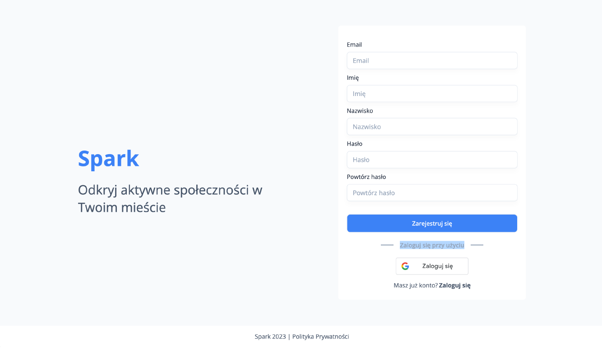
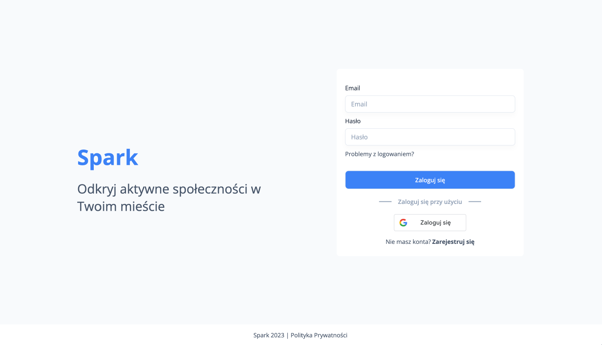
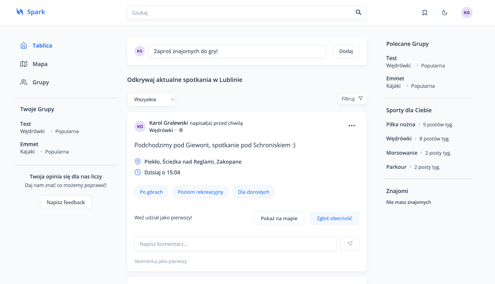
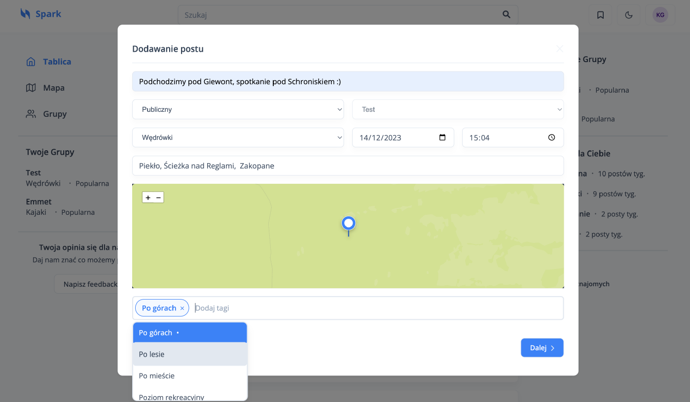
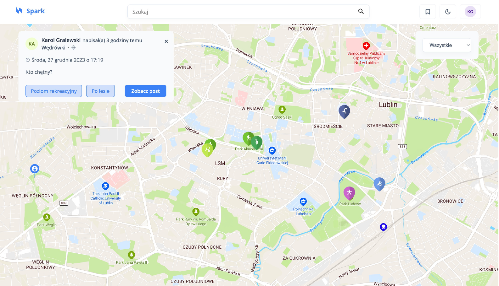
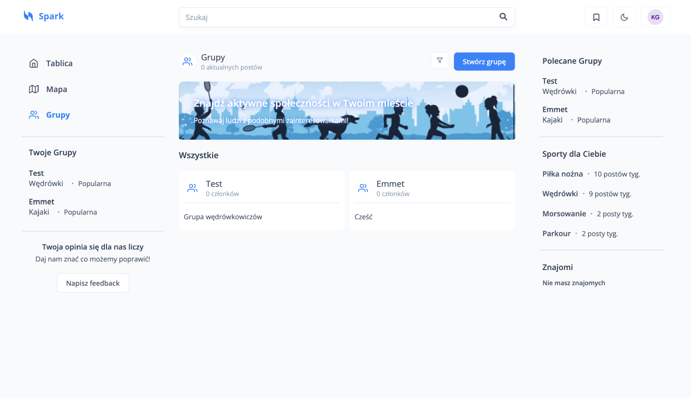
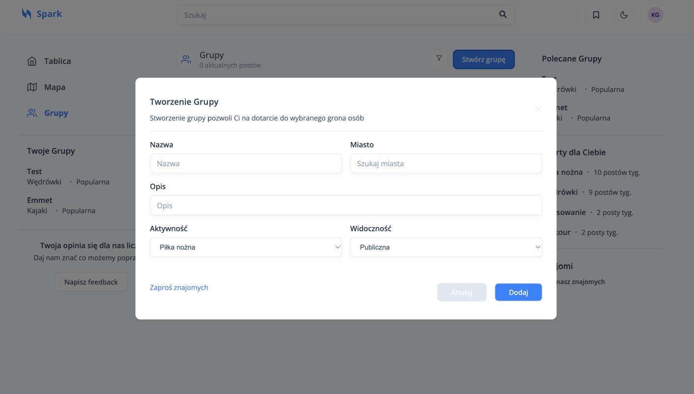
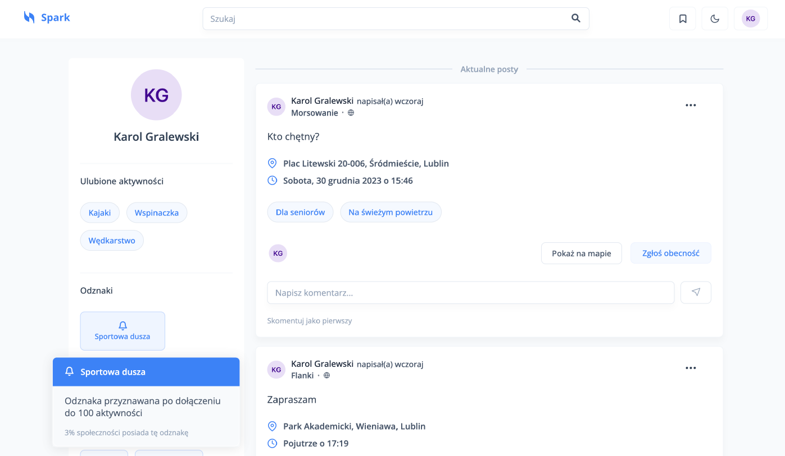

# Trybe - Frontend

Trybe is an innovative web application designed to help users organize and participate in sports meetings. The platform allows users to create their profiles, browse available sports events on an interactive map, and join groups that share similar interests. With features like notifications and social interactions, Trybe encourages an active lifestyle and makes it easier to connect with like-minded individuals.

## Technologies Used in the Project

### Core Technologies:

- **React** - library for building user interfaces.
- **Redux Toolkit** - application state management.
- **React Router** - routing management.
- **Styled Components** - component styling.
- **Leaflet & React-Leaflet** - interactive maps.
- **React Hook Form & Yup** - form management and validation.
- **Vite** - tool for building and running the application.

### Additional Libraries and Tools:

- **ESLint & Prettier** - code analysis and formatting.
- **Vitest & Testing Library** - component testing.

## Installation and Running

1. Install dependencies:
   ```bash
   npm install
   ```
2. Run the application in development mode:
   ```bash
   npm run dev
   ```

## Project Structure

```
frontend/
├── src/
│   ├── assets/          # Graphics, styles, and constants
│   ├── components/      # UI components
│   ├── store/           # Redux functionalities
│   ├── views/           # Main application views
│   ├── hooks/           # Hooks used in the application
│   ├── helpers/         # Utility functions
│   ├── providers/       # Wrapping components
│   ├── main.jsx         # Application entry point
│
├── public/              # Static files
├── package.json         # Project configuration file
├── vite.config.js       # Vite configuration
└── README.md            # Documentation
```

## Application Features

- User registration and login (including Google OAuth).
  
  
- Browsing other users posts on dashboard.
  
- Add post about activity.
  
- Browsing users activity on the map.
  
- Browsing and creating sports groups.
  
  
- Browsing your profile.
  

## Authors

- **Adrian Górski**
- **Dawid Grabek**
- **Karol Gralewski**
